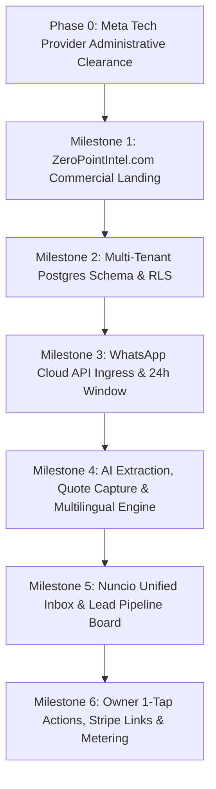

# Nuncio (by ZeroPointIntel) — Master Platform Roadmap

**v1.0 — 2026-08-28** · Authoritative execution roadmap derived from `Nuncio_platform_SPEC_v1.0.md`, integrating core deterministic engines from `SPECS.md`, `Metering_and_plans_SPEC.md`, and `Salesops_token_costs_and_catalogue.md`.

---

## 1. Product Foundations & Non-Negotiables

Every task across all work packages must strictly adhere to the project core constraints:

1. **Contact vs. Lead Separation**: A contact is a person; a lead is a distinct commercial opportunity. A customer requesting a deep clean in March and window cleaning in August is one contact and two leads.
2. **Deterministic Catalog Grounding & Zero Price Invention**: The AI assistant never states a price, availability, or lead time not present in the offering data. If it isn't verified in the catalog, it escalates.
3. **Owner in the Loop for Money**: Any transition touching money or commitment requires a human. The AI proposes and qualifies; only a human moves a lead to `won`.
4. **Strict Multi-Tenant Isolation**: Shared PostgreSQL with `tenant_id` on every row enforced by Row-Level Security (RLS) policies. Object storage keys are tenant-prefixed.
5. **Idempotent Webhook Ingress**: Webhooks acknowledge `200 OK` immediately; processing is asynchronous and strictly deduplicated by `wamid`.
6. **24-Hour WhatsApp Service Window Enforcement**: Sends outside the 24-hour customer window are refused at the API layer (no templates in M1).
7. **Multilingual Architecture**: UI in DE/FR/IT/EN; conversation language resolved per contact and sticky; Swiss German voice notes transcribed, normalized to Hochdeutsch, and answered in clean business Hochdeutsch.
8. **Direct Meta Billing Alignment**: Merchants connect via Meta Embedded Signup with their own payment method; Nuncio charges a software subscription. Per-message cost estimates and category tracking are recorded from day one.

---

## 2. Milestone Overview

---

## 3. Detailed Work-Package Breakdown

### Phase 0: Meta Tech Provider Setup *(In Progress / Verification In Review)*
> **Goal:** Complete Meta administrative requirements for the Tech Provider program to enable automated customer onboarding via Embedded Signup.

- [x] **WP-P0.1: Meta Developer Registration & Business Portfolio Setup**
  - [x] Verified developer profile with 2FA on `developers.facebook.com`.
  - [x] Created Meta Business App **Nuncio** (App ID: `1584644373301704`) under business portfolio `zeropointintel` (`1188005875832676`).
  - [x] Designated as an official **Meta Tech Provider**.
  - [x] Submitted legal Business Verification for `Nuno Miguel Pires Ribeiro` (Status: *In Review*).
- [x] **WP-P0.2: Embedded Signup & App Review Preparation**
  - [x] Configure Facebook Login for Business with WhatsApp Embedded Signup scopes (`whatsapp_business_management`, `whatsapp_business_messaging`).
  - [x] Prepare App Review screen-recording walkthrough (`docs/meta/APP_REVIEW_SUBMISSION_GUIDE.md`) and GDPR/revDSG privacy, terms, and DPA documentation (`legal/`).

---

### Milestone 1: ZeroPointIntel.com Commercial Rebranding & Sales Landing *(Completed)*
> **Goal:** Transform ZeroPointIntel.com into a clean, modern, high-converting sales platform spotlighting Nuncio for everyday businesses (B2B service trades + E-Commerce) while organizing deep-tech/cybersecurity systems into a dedicated "Portfolio & Solutions" section.

- [x] **WP-M1.1: Hero Section & Core Value Proposition**
  - [x] Clear business headline: *"Every WhatsApp enquiry answered in under a minute — turned into a structured lead for your business."*
  - [x] Interactive live simulation widget: Inbound WhatsApp enquiry $\rightarrow$ Structured Lead Card with Completeness Score.
  - [x] Clean, trustworthy modern design aesthetic (light/dark accessible palette, refined typography).
- [x] **WP-M1.2: Dual Market Solutions**
  - [x] **Service Trades & B2B (Cleaning, Construction, Local Pros)**: Automated quote capture (m², rooms, frequency, location, date), Swiss German voice note handling, zero lost jobs while on a ladder.
  - [x] **E-Commerce Stores (Shopify, WooCommerce, Custom)**: Real-time stock verification, order drafting, instant Stripe checkout links in chat.
- [x] **WP-M1.3: Compliance, Swiss Trust & Portfolio Assets Section**
  - [x] Trust badges: Meta Tech Provider Cloud API, EU AI Act Art. 50 disclosure, Swiss/EU data residency (revDSG & GDPR).
  - [x] Dedicated *"Portfolio & Deep-Tech Solutions"* showcase preserving ZeroPointIntel's engineering pedigree (IoT telemetry, cybersecurity, high-assurance distributed systems).

---

### Milestone 2: Multi-Tenant Postgres Schema & Row-Level Security *(Completed)*
> **Goal:** Implement the authoritative domain schema with strict Row-Level Security (RLS) across all tables.

- [x] **WP-M2.1: Multi-Tenancy & Channel Schemas**
  - [x] `tenant` (id, name, legal_name, country, vertical_pack_id, timezone, default_language, status, plan).
  - [x] `user` & `membership` (tenant_id, user_id, role: `owner` | `agent` | `viewer`).
  - [x] `channel` (tenant_id, type: `whatsapp`, waba_id, phone_number_id, display_number, status, token_ref).
- [x] **WP-M2.2: Contacts, Conversations & Messages**
  - [x] `contact` (tenant_id, wa_id, display_name, phone_e164, language, tags, consent_source, consent_at).
  - [x] `conversation` (tenant_id, channel_id, contact_id, status: `open`/`snoozed`/`closed`, service_window_expires_at, ai_mode: `off`/`suggest`/`auto`).
  - [x] `message` (tenant_id, conversation_id, direction, wamid [UNIQUE], type, body, billing_category, cost_estimate, author).
- [x] **WP-M2.3: Leads, Offerings & Event Timeline**
  - [x] `lead` (tenant_id, contact_id, lead_type: `quote_request`/`appointment_request`/`product_enquiry`, state: `new` $\rightarrow$ `qualifying` $\rightarrow$ `interested` $\rightarrow$ `quoted` $\rightarrow$ `order_pending` $\rightarrow$ `won`/`lost`/`dormant`, score, value_estimate).
  - [x] `offering` (tenant_id, sku, name, description, price_type, price, currency, service_area, duration_minutes, active, embedding).
  - [x] `quote_request` (tenant_id, lead_id, fields [JSONB], completeness: 0.0–1.0, missing_fields).
  - [x] `order` & `payment` (tenant_id, lead_id, contact_id, line_items, status, stripe_payment_intent_id).
  - [x] `event` (append-only timeline) & `ai_run` (token usage, latency, prompt_ref, outcome).
- [x] **WP-M2.4: Row-Level Security (RLS) Enforcement**
  - [x] Write automated CI tests verifying that cross-tenant queries are blocked at the database level.

---

### Milestone 3: WhatsApp Cloud API Ingress & 24-Hour Service Window Engine *(Completed)*
> **Goal:** High-throughput, signature-verified webhook ingress with Redis/BullMQ queueing and strict 24-hour customer service window enforcement.

- [x] **WP-M3.1: Thin Webhook Ingress Service**
  - [x] `GET /webhook`: Verify `hub.challenge` and `hub.verify_token`.
  - [x] `POST /webhook`: Verify HMAC-SHA256 signature against App Secret (`X-Hub-Signature-256`).
  - [x] Enqueue raw payload to BullMQ Redis queue and return `200 OK` within 100ms.
- [x] **WP-M3.2: Asynchronous Idempotent Message Processor**
  - [x] Idempotency guard on `wamid` preventing duplicate message rows or duplicate AI responses.
  - [x] Inbound media downloader (images, documents, voice notes) to EU object storage with signed URLs.
- [x] **WP-M3.3: 24-Hour Service Window Guard**
  - [x] Calculate and update `service_window_expires_at = last_inbound + 24h`.
  - [x] Outbound send API strictly rejects free-form messages if `now() > service_window_expires_at`.
  - [x] Fallback to Meta Approved Template Message when customer service window is expired.

---

### Milestone 4: AI Qualification, Quote Field Extraction & Multilingual Engine *(Completed)*
> **Goal:** Grounded conversational AI that extracts structured trade quote fields, speaks the customer's language, normalizes Swiss German, and enforces zero-hallucination guardrails.

- [x] **WP-M4.1: Sticky Contact Language & Swiss German Normalization**
  - [x] Language detection on first inbound message; store on `contact.language` (DE, FR, IT, EN).
  - [x] Swiss German dialect detection on inbound voice/text; normalize to Hochdeutsch for intent classification.
  - [x] Outbound response generation strictly in high-assurance business Hochdeutsch (or French/Italian/English matching customer).
- [x] **WP-M4.2: Structured Quote Field Extraction (Cleaning Vertical Pack)**
  - [x] Intent classification: `quote_request`, `appointment_request`, `product_enquiry`, `support`, `human_request`.
  - [x] Extract structured fields: property type, rooms, square meters ($m^2$), frequency (one-off, bi-weekly, monthly), location/postcode, access, preferred timing.
  - [x] Compute real-time `completeness` score ($0.0 - 1.0$) and `missing_fields[]`.
- [x] **WP-M4.3: Non-Overridable Guardrails & AI Modes**
  - [x] Modes: `off` (inbox only), `suggest` (AI drafts, human sends), `auto` (autonomous for whitelisted intents).
  - [x] Gating: `auto` mode locked until tenant has $\ge 10$ active offerings with prices.
  - [x] Instant escalation on complaints, refund requests, discount negotiations, or out-of-catalog inquiries.

---

### Milestone 5: Nuncio Unified Inbox & Lead Pipeline Management UI *(Completed)*
> **Goal:** Responsive web dashboard providing real-time WhatsApp conversation management, lead kanban pipeline, and trade quote summaries.

- [x] **WP-M5.1: Unified WhatsApp Inbox**
  - [x] Real-time conversation list (search, filters by status, assignee, unread).
  - [x] Chat stream with delivery status ticks (`queued`, `sent`, `delivered`, `read`), audio player with transcription, and internal team notes.
  - [x] AI Suggest mode box: one-click send or edit draft.
- [x] **WP-M5.2: Visual Lead Pipeline Board**
  - [x] Stages: `New` $\rightarrow$ `Qualifying` $\rightarrow$ `Interested` $\rightarrow$ `Quoted` $\rightarrow$ `Order Pending` $\rightarrow$ `Won` / `Lost`.
  - [x] Lead Cards displaying contact name, phone, quote summary, completeness progress bar, and estimated value.
  - [x] Human confirmation enforcement: only a tenant user can drag a lead to `Won`.
- [x] **WP-M5.3: Offering & Catalog Management**
  - [x] Ingestion 1: Guided vertical pack setup (pre-filled Swiss cleaning services & typical rates).
  - [x] Ingestion 2: CSV/XLSX spreadsheet upload with column mapping.
  - [x] Ingestion 3: WooCommerce REST API and Shopify Admin API sync.

---

### Milestone 6: Owner 1-Tap Actions, Stripe Links & Unit Economics Metering *(Completed)*
> **Goal:** Mobile-friendly owner confirmation flows, Stripe payment checkout links, and transparent per-message cost tracking.

- [x] **WP-M6.1: Owner WhatsApp Control Plane & 1-Tap Confirmation**
  - [x] Dispatch WhatsApp notifications to owner when a quote request reaches $\ge 80\%$ completeness or customer confirms order.
  - [x] Slash command control plane (`/status`, `/pause`, `/resume`, `/takeover`, `/approve`, `/override`, `/handoff`).
- [x] **WP-M6.2: Stripe Payment Integration**
  - [x] Generate dynamic Stripe Payment Links for deposit or full quote amount inside chat.
  - [x] Stripe webhook handler updating `order.status = 'paid'` upon successful payment.
- [x] **WP-M6.3: Unit Economics & October 2026 Pricing Metering**
  - [x] Track message billing category (`service`, `utility`, `marketing`, `authentication`) and estimate Meta cost.
  - [x] Tenant dashboard reporting: Month-to-date Meta messaging cost breakdown and platform subscription usage.

