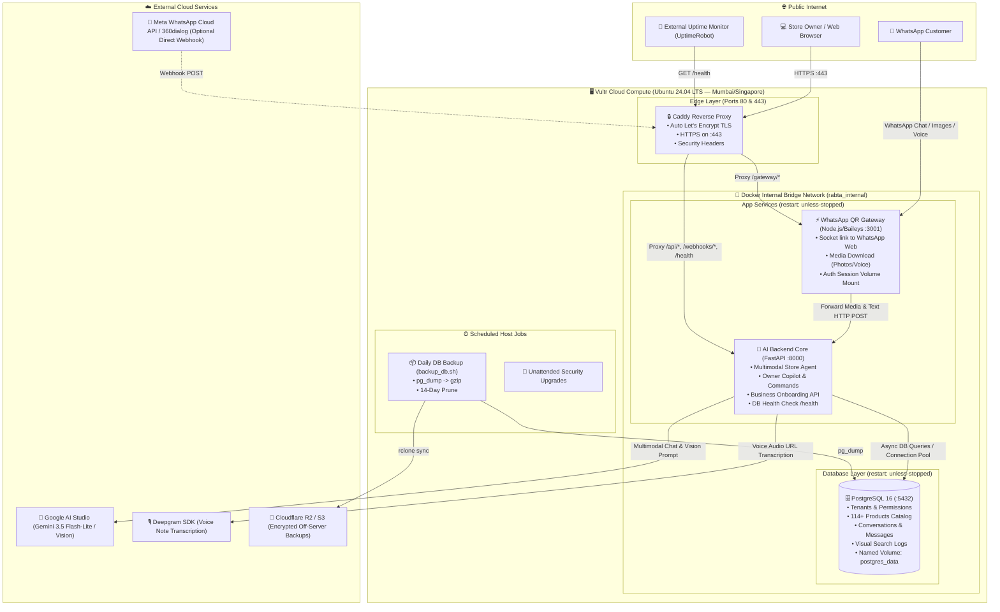

# Rabta AI — Production System Architecture

---

## Component Responsibilities

| Service | Technology | Port (Internal) | External Access | Key Responsibility |
|---|---|---|---|---|
| **Caddy** | Caddy v2 Alpine | `80`, `443` | `80`, `443` (Public) | Handles HTTPS certificates via Let's Encrypt, security headers, and routes inbound traffic. |
| **Backend** | Python 3.11 / FastAPI | `8000` | Via Caddy only | Runs Gemini multimodal AI agent, tenant-isolated DB queries, owner copilot commands, and business onboarding. |
| **Gateway** | Node.js 20 / Baileys | `3001` | Via Caddy (`/gateway/*`) | Bridges WhatsApp Web protocol, auto-downloads media (images/voice) into Base64 for the AI engine. |
| **PostgreSQL** | PostgreSQL 16 Alpine | `5432` | Internal Docker network only | Relational and catalog store for tenants, products, customers, and conversation histories. Zero port exposure on the public internet. |
