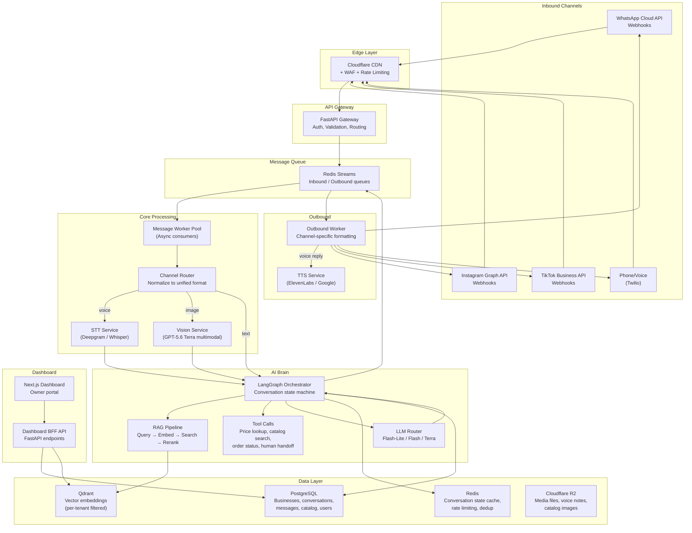
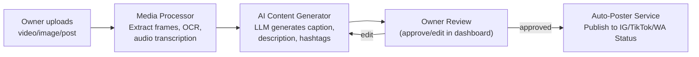

# RABTA AI — Complete Technical Plan
**From Requirements to Production Deployment**

---

## 1. Requirements Breakdown

### 1.1 Functional Requirements

| ID | Requirement | Priority |
|:---|:-----------|:---------|
| F1 | **Multi-channel message ingestion** — Receive customer messages from WhatsApp (text + voice notes + images), Instagram (DMs, comments, Story replies), TikTok (comments, DMs), and phone calls | P0 (MVP: WhatsApp only) |
| F2 | **Per-business AI persona** — Each business gets an AI that knows its catalog, pricing, tone, and industry jargon. Must sound human, not robotic | P0 |
| F3 | **Multilingual conversations** — Urdu + English at launch; Pashto, Hindko later; Chinese (WeChat) in future phases | P0 (Urdu + English) |
| F4 | **Knowledge base per business** — Owner uploads catalog (text, images, PDFs, voice recordings) and the AI uses it in real-time conversations | P0 |
| F5 | **Sales-driven responses** — AI should actively drive conversions, not just answer FAQs. Recommend products, handle objections, negotiate within owner-defined boundaries | P0 |
| F6 | **Voice note processing** — Receive WhatsApp voice notes → transcribe (STT) → generate text response → optionally convert to voice reply (TTS) | P1 |
| F7 | **Image understanding** — Customer sends a product photo → AI identifies/matches from catalog and responds | P1 |
| F8 | **Owner dashboard** — Business owner sees conversations, analytics, can override AI responses, manage catalog, set pricing, configure AI tone/persona | P0 |
| F9 | **Content generation & auto-posting** — AI generates video descriptions, post captions, Story replies, and optionally auto-publishes to channels | P2 |
| F10 | **Multi-tenancy** — Fully isolated data, prompts, and knowledge bases per business tenant | P0 |
| F11 | **Conversation memory** — AI remembers past conversations with each customer within a business context | P1 |
| F12 | **Human handoff** — Seamless escalation to a human operator when AI is uncertain or customer requests it | P1 |
| F13 | **Billing & subscription management** — Pakistani payment rails (JazzCash, Easypaisa, bank transfer) | P1 |

### 1.2 Non-Functional Requirements

| Requirement | Target |
|:-----------|:-------|
| **Response latency** | < 3 seconds for text replies; < 8 seconds for voice-note-to-text pipeline |
| **Uptime** | 99.5% (pilot), 99.9% (production) |
| **Scale** | Support 500+ businesses, each handling 50–500 conversations/day |
| **Data residency** | Customer data should stay accessible within Pakistan-friendly jurisdictions. No EU-specific data export issues |
| **Cost ceiling** | LLM cost per conversation < PKR 5 (~$0.015) at scale |
| **Onboarding time** | < 15 minutes for a non-technical business owner to go from signup to first AI reply |
| **Language accuracy** | > 90% intent accuracy for Urdu; > 85% for Pashto |

### 1.3 Deceptively Hard Problems (Risk Areas)

> [!CAUTION]
> These are the requirements most likely to cause delays, quality issues, or architectural pivots.

1. **"Urdish" code-switching** — Pakistani business conversations constantly mix Urdu + English + Roman Urdu in the same sentence. Most LLMs handle this poorly without careful prompt engineering and examples. **Mitigation:** Extensive few-shot examples in system prompts; "Urdish" training data in RAG; consider fine-tuning a smaller model specifically for language detection and normalization.

2. **Low-resource language STT (Pashto, Hindko)** — No production-grade off-the-shelf STT exists for Hindko. Pashto has emerging support but accuracy is ~70%. **Mitigation:** Start with Urdu + English voice only; use Whisper fine-tuned on Pashto data when expanding; defer Hindko to Phase 5+.

3. **Making AI sound human, not bot-like** — This is the core brand promise. Generic LLM outputs feel "too polished" for Pakistani business contexts. **Mitigation:** Per-industry prompt templates with colloquial examples; A/B test AI responses with real business owners; implement "personality tuning" where owner rates and corrects AI tone.

4. **TikTok automation limits** — TikTok's Business Messaging API has a **10-message limit per thread** and a **48-hour engagement window**. Comment-to-DM flows are region-restricted (not available in US/EU/UK, but available in select Asian markets — Pakistan availability needs verification). **Mitigation:** TikTok is Phase 4, not MVP. By then, evaluate whether official API access is feasible or if we need a "redirect to WhatsApp" strategy.

5. **Preventing price hallucination** — If the AI confidently quotes a wrong price, it destroys trust and creates legal liability. **Mitigation:** Structured catalog/pricing data in RAG (not free-text); price lookup is a deterministic tool call, not generated text; mandatory confidence thresholds with fallback to "let me check with the owner."

6. **WhatsApp Business API compliance** — Meta's template message approval process and 24-hour window rules require careful architectural handling. **Mitigation:** Design message routing to always respond within 24-hour service window; pre-approve template messages for common scenarios.

### 1.4 Out of Scope for v1/MVP

| Feature | Why deferred |
|:--------|:-------------|
| TikTok integration | API restrictions, uncertain Pakistan availability |
| Phone call handling (live telephony) | Requires dedicated telephony stack (Twilio/similar); high cost |
| WeChat / Chinese language | Different market, different compliance; Phase 5+ |
| Content auto-posting | Requires publishing API access + content moderation; Phase 3+ |
| Pashto / Hindko voice | Insufficient STT quality; start with text-only for these languages |
| AI-generated video | Extremely high compute cost; defer to Phase 5+ |
| White-labeling | Enterprise feature, not needed for initial SME pilot |

---

## 2. Tech Stack Recommendation

### 2.1 LLM / AI Orchestration Layer

**Recommendation: Tiered model routing with Gemini 3.7 Flash (primary) + GPT-5.6 Terra (complex fallback)**

| Decision | Recommendation | Alternative | Why |
|:---------|:--------------|:------------|:----|
| **Primary LLM** | Gemini 3.7 Flash ($0.38/$1.88 per M tokens) | GPT-5.6 Luna ($0.20/$1.20) | Flash offers better multilingual (Urdu) quality at comparable cost. Luna is cheaper but weaker on Urdu nuance |
| **Complex fallback** | GPT-5.6 Terra ($2.00/$12.00) | Claude Sonnet 5 ($2.00/$10.00) | For edge cases requiring deep reasoning (negotiation, complex product matching). Terra has better tool-calling reliability |
| **Orchestration** | LangChain + LangGraph (Python) | LlamaIndex | LangGraph's stateful graph execution maps perfectly to multi-step conversation flows (RAG → tool calls → response). LlamaIndex is stronger for pure RAG but weaker for agentic workflows |
| **Prompt architecture** | RAG + structured tool calls | Fine-tuning | Fine-tuning requires 10K+ curated examples per industry and costs $50K+. RAG with good prompts gets 85% of the quality at 1% of the cost. Revisit fine-tuning at 200+ businesses when we have real conversation data |

**Model routing logic:**
```
IF message is simple greeting/FAQ → Gemini Flash-Lite ($0.15/$1.25)
IF message requires catalog lookup/pricing → Gemini Flash + tool calls
IF message requires complex negotiation/multi-turn reasoning → GPT-5.6 Terra
IF message is in Pashto (text) → GPT-5.6 Terra (best low-resource lang performance)
```

### 2.2 Vector Store / Knowledge Base

**Recommendation: Qdrant (self-hosted)**

| Option | Pros | Cons |
|:-------|:-----|:-----|
| **Qdrant (recommended)** | Best filtering performance (critical for per-tenant isolation), strong free tier, self-hostable for cost control, native hybrid search | Must manage infra if self-hosted |
| pgvector | Zero new infrastructure if using Postgres already | Performance degrades past 1M vectors; no native hybrid search |
| Pinecone | Zero-ops, fastest time to market | Expensive at scale ($70+/mo per index); no self-hosting; vendor lock-in |

**Rationale:** At MVP (5 businesses, ~5K vectors each), pgvector would suffice. But Qdrant's filtering allows us to use a single collection with `tenant_id` metadata filtering, which scales cleanly to 500+ tenants without index-per-tenant overhead.

**Embedding model:** `text-embedding-3-small` (OpenAI) — 1536 dims, $0.02/M tokens. Best cost/quality for multilingual including Urdu.

### 2.3 Backend Framework

**Recommendation: Python (FastAPI)**

| Option | Pros | Cons |
|:-------|:-----|:-----|
| **FastAPI (recommended)** | Async-native (critical for concurrent webhook handling), best LLM/AI library ecosystem (LangChain, Whisper, etc.), type-safe, auto-generated OpenAPI docs | Slower than Go for raw throughput (irrelevant at our scale) |
| Node.js (Express/Fastify) | JS ecosystem, good for real-time | Worse AI/ML library support; LangChain.js lags behind Python |
| Go (Gin) | Raw performance | Terrible AI/ML ecosystem; would need Python microservice anyway |

### 2.4 Databases

| Layer | Technology | Reasoning |
|:------|:-----------|:----------|
| **Primary relational** | PostgreSQL 16 (on Nayatel Cloud or DigitalOcean managed) | Rock-solid, free, handles all structured data. Managed instance eliminates DBA overhead |
| **Vector** | Qdrant (self-hosted on same VPS cluster) | See §2.2 |
| **Cache / session** | Redis 7 (or Dragonfly) | Conversation state, rate limiting, webhook dedup. Sub-ms latency |
| **Object storage** | S3-compatible (Cloudflare R2 or MinIO self-hosted) | Catalog images, voice notes, uploaded PDFs. R2 has zero egress fees |

### 2.5 Messaging / Queueing

**Recommendation: Redis Streams (MVP) → migrate to Apache Kafka (at 100+ tenants)**

- **Redis Streams** — Already running Redis for cache; Streams adds zero new infrastructure. Handles consumer groups, acknowledgments, dead-letter. Sufficient for 500 msgs/sec.
- **Kafka** — Only needed when we exceed Redis Streams' single-node limits or need cross-datacenter replication.

**Message flow:**
```
Webhook arrives → FastAPI validates → publishes to Redis Stream (channel: "inbound")
Worker consumer group picks up → RAG + LLM processing → publishes to "outbound" stream
Outbound worker sends via channel-specific API (WhatsApp Cloud API, Instagram API, etc.)
```

### 2.6 Channel Integrations

#### WhatsApp (MVP — Phase 1)
**Recommendation: WhatsApp Cloud API (direct, no BSP)**

- **Why direct:** Avoids BSP markup fees (PKR 3K–14K/mo); Meta's Cloud API is well-documented; we own the integration logic.
- **BSP alternative:** If Meta Business Verification is problematic, fall back to WeTarseel or Postabi as temporary BSP.
- **Pricing:** Service messages (within 24hr window) are **free**. Template messages (marketing/utility) are per-message based on Pakistan rates.

#### Instagram (Phase 3)
- **API:** Instagram Graph API + Messenger API for DMs
- **Key constraint:** 24-hour messaging window; comment-to-DM flows require `instagram_manage_comments` + `instagram_manage_messages` permissions
- **Rate limit:** ~200 DMs/hour

#### TikTok (Phase 4)
- **API:** TikTok Business Messaging API
- **Key constraints:** 10-message limit per thread, 48-hour window, no cold DMs
- **Strategy:** "Comment keyword → redirect to WhatsApp" as primary flow; native DM as secondary

#### Voice / STT / TTS

| Component | Provider | Language Support | Cost |
|:----------|:---------|:----------------|:-----|
| **STT (Speech-to-Text)** | Deepgram (primary) | Urdu, English | $0.0043/min (pay-as-you-go) |
| **STT fallback** | OpenAI Whisper API | Urdu, English, Pashto (fine-tuned) | $0.006/min |
| **TTS (Text-to-Speech)** | ElevenLabs | Urdu, English (natural voice) | $0.18/1K chars (Scale plan) |
| **TTS budget fallback** | Google Cloud TTS | Urdu, English | $0.000004/char |

### 2.7 Frontend / Dashboard

**Recommendation: Next.js 15 (App Router) + shadcn/ui**

| Option | Pros | Cons |
|:-------|:-----|:-----|
| **Next.js + shadcn/ui (recommended)** | SSR for SEO (marketing pages), excellent component library, great DX, built-in API routes for BFF pattern | Heavier than Vite SPA |
| Vite + React | Lighter, faster builds | No SSR; marketing pages need separate solution |

**Dashboard features (Phase 2):**
- Real-time conversation feed with AI/human labels
- Catalog/pricing manager (CRUD with image upload)
- AI persona editor (tone slider, example conversations, test sandbox)
- Analytics (response time, conversation volume, conversion rate)
- Billing & plan management

### 2.8 Auth & Multi-Tenancy

**Recommendation: Clerk (auth) + row-level security (multi-tenancy)**

- **Clerk** — Managed auth with WhatsApp OTP login (critical for Pakistani business owners who won't use email/password), organization/team support, session management. Cost: Free up to 10K MAU.
- **Multi-tenancy model:** Shared database with `tenant_id` column on every table + PostgreSQL Row-Level Security (RLS) policies. This is the right trade-off for a startup: zero infrastructure overhead per tenant, instant onboarding, simpler backups.
- **Alternative:** Separate schema per tenant — better isolation, but operational nightmare at 500+ tenants.

### 2.9 Hosting / Cloud

**Recommendation: Hybrid — DigitalOcean (primary compute) + Cloudflare (edge/storage)**

| Component | Provider | Why |
|:----------|:---------|:----|
| **Application servers** | DigitalOcean Droplets (SGP1 Singapore region) | Lowest latency to Pakistan (~50ms) among global clouds; predictable pricing ($24-48/mo per Droplet); simple managed Kubernetes available |
| **Database** | DigitalOcean Managed PostgreSQL | Automated backups, failover, patching. $15/mo starter |
| **CDN / Edge** | Cloudflare (free tier + R2 storage) | Zero-egress object storage, DDoS protection, global CDN for dashboard |
| **DNS** | Cloudflare | Free, fast |

**Why not AWS/GCP?** Unpredictable billing, USD-only, 200-400ms latency from nearest regions (Mumbai/Bahrain), complex pricing model. DigitalOcean gives 80% of the capability at 30% of the cost.

**Why not local Pakistan hosting (Nayatel)?** Nayatel is viable for data residency compliance but lacks managed Kubernetes, managed databases, and load balancing. Consider it for Phase 5+ if Pakistani data residency regulations mandate it.

### 2.10 CI/CD, Containerization, Monitoring

| Component | Tool | Reasoning |
|:----------|:-----|:----------|
| **Containerization** | Docker + Docker Compose (dev), Kubernetes (prod) | Standard. DigitalOcean managed K8s is $12/mo |
| **CI/CD** | GitHub Actions | Free for public repos; generous free tier for private. YAML-based, good Docker/K8s integration |
| **Monitoring** | Grafana Cloud (free tier: 10K metrics, 50GB logs) | Prometheus metrics + Loki logs + Grafana dashboards. Free tier is generous enough for first year |
| **Error tracking** | Sentry (free tier) | Python + Next.js integration. Catches unhandled exceptions with full stack traces |
| **Uptime monitoring** | Better Uptime (free tier) | Ping monitoring + status page |
| **LLM observability** | LangSmith (LangChain's) | Traces every LLM call: latency, token count, cost, prompt/response. Critical for debugging AI quality |

### 2.11 Payments / Billing

**Recommendation: Unified gateway (Rapid Gateway or AssanPay) + Stripe (international fallback)**

| Provider | Supports | Use Case |
|:---------|:---------|:---------|
| **Rapid Gateway / AssanPay** | JazzCash, Easypaisa, Raast, bank transfer, cards | Pakistani customers (95% of user base) |
| **Stripe** | International cards | International customers, future expansion |

**Billing model:** Monthly subscription with usage-based overage (conversations beyond plan limit).

---

## 3. System Architecture

### 3.1 High-Level Architecture



### 3.2 Multi-Tenancy Model

**Shared infrastructure, isolated data:**

```
┌─────────────────────────────────────────────┐
│              Shared Infrastructure           │
│  ┌──────────┐  ┌──────────┐  ┌──────────┐  │
│  │ FastAPI   │  │ LangGraph│  │ Workers  │  │
│  │ Gateway   │  │ Engine   │  │ Pool     │  │
│  └──────────┘  └──────────┘  └──────────┘  │
├─────────────────────────────────────────────┤
│          Tenant Isolation Layer              │
│                                             │
│  PostgreSQL: Row-Level Security (RLS)       │
│    - Every table has `tenant_id` column     │
│    - RLS policy: WHERE tenant_id = current  │
│    - SET app.current_tenant = '<uuid>'      │
│                                             │
│  Qdrant: Metadata filtering                 │
│    - Single collection "knowledge_base"     │
│    - Filter: {"tenant_id": "<uuid>"}        │
│    - Separate API keys per tenant (future)  │
│                                             │
│  Redis: Key prefixing                       │
│    - Pattern: tenant:{id}:conv:{conv_id}    │
│                                             │
│  R2/S3: Path-based isolation                │
│    - Bucket: rabta-media                    │
│    - Path: /{tenant_id}/catalog/...         │
│    - Path: /{tenant_id}/voice_notes/...     │
└─────────────────────────────────────────────┘
```

### 3.3 Conversation State & Memory

**Two-tier memory architecture:**

| Tier | Storage | TTL | Purpose |
|:-----|:--------|:----|:--------|
| **Short-term** (active conversation) | Redis hash | 24 hours | Current conversation context, last N messages, customer intent, active product discussion |
| **Long-term** (customer history) | PostgreSQL | Indefinite | Full message history, purchase history, preferences, language preference. Summarized and embedded into Qdrant for semantic recall |

**State machine per conversation:**
```
IDLE → GREETING → PRODUCT_INQUIRY → NEGOTIATION → CLOSING → ORDER_PLACED
                                                 → HUMAN_HANDOFF
                                                 → ABANDONED (after 24hr timeout)
```

### 3.4 Content Ingestion Pipeline (Phase 3)



---

## 4. Data Model

### 4.1 Core Schema (PostgreSQL)

```sql
-- ==========================================
-- TENANT & USER MANAGEMENT
-- ==========================================

CREATE TABLE tenants (
    id              UUID PRIMARY KEY DEFAULT gen_random_uuid(),
    name            VARCHAR(255) NOT NULL,           -- "Ahmed Textiles"
    industry_id     UUID REFERENCES industries(id),
    plan_id         UUID REFERENCES plans(id),
    onboarding_status VARCHAR(50) DEFAULT 'pending', -- pending, active, suspended
    ai_persona_config JSONB,                         -- tone, language prefs, greeting style
    created_at      TIMESTAMPTZ DEFAULT NOW(),
    updated_at      TIMESTAMPTZ DEFAULT NOW()
);

CREATE TABLE industries (
    id              UUID PRIMARY KEY DEFAULT gen_random_uuid(),
    name            VARCHAR(100) NOT NULL,           -- "Textile", "Retail", "Restaurant"
    default_persona JSONB,                           -- industry-specific default prompts
    created_at      TIMESTAMPTZ DEFAULT NOW()
);

CREATE TABLE users (
    id              UUID PRIMARY KEY DEFAULT gen_random_uuid(),
    tenant_id       UUID NOT NULL REFERENCES tenants(id),
    clerk_user_id   VARCHAR(255) UNIQUE,             -- Clerk auth ID
    name            VARCHAR(255),
    phone           VARCHAR(20),
    email           VARCHAR(255),
    role            VARCHAR(50) DEFAULT 'owner',     -- owner, admin, operator
    created_at      TIMESTAMPTZ DEFAULT NOW()
);

-- ==========================================
-- CUSTOMER MANAGEMENT
-- ==========================================

CREATE TABLE customers (
    id              UUID PRIMARY KEY DEFAULT gen_random_uuid(),
    tenant_id       UUID NOT NULL REFERENCES tenants(id),
    phone           VARCHAR(20),
    name            VARCHAR(255),
    language_pref   VARCHAR(10) DEFAULT 'ur',        -- ur, en, ps, hk
    channel_ids     JSONB,                           -- {"whatsapp": "+92...", "instagram": "@..."}
    metadata        JSONB,                           -- tags, notes, purchase history summary
    first_seen_at   TIMESTAMPTZ DEFAULT NOW(),
    last_seen_at    TIMESTAMPTZ DEFAULT NOW()
);

-- ==========================================
-- CATALOG & KNOWLEDGE BASE
-- ==========================================

CREATE TABLE catalog_items (
    id              UUID PRIMARY KEY DEFAULT gen_random_uuid(),
    tenant_id       UUID NOT NULL REFERENCES tenants(id),
    name            VARCHAR(500) NOT NULL,
    name_urdu       VARCHAR(500),
    description     TEXT,
    description_urdu TEXT,
    category        VARCHAR(255),
    price           DECIMAL(12,2),
    price_unit      VARCHAR(50) DEFAULT 'PKR',
    price_range_min DECIMAL(12,2),                   -- for negotiable items
    price_range_max DECIMAL(12,2),
    in_stock        BOOLEAN DEFAULT true,
    images          TEXT[],                           -- R2 URLs
    metadata        JSONB,                           -- size, color, fabric, weight, etc.
    embedding_id    VARCHAR(255),                     -- Qdrant point ID
    created_at      TIMESTAMPTZ DEFAULT NOW(),
    updated_at      TIMESTAMPTZ DEFAULT NOW()
);

CREATE TABLE knowledge_base_items (
    id              UUID PRIMARY KEY DEFAULT gen_random_uuid(),
    tenant_id       UUID NOT NULL REFERENCES tenants(id),
    title           VARCHAR(500),
    content         TEXT NOT NULL,                    -- FAQ answer, policy, business info
    content_type    VARCHAR(50),                      -- faq, policy, about, custom
    language        VARCHAR(10) DEFAULT 'en',
    embedding_id    VARCHAR(255),                     -- Qdrant point ID
    source          VARCHAR(50),                      -- manual, pdf_upload, voice_transcription
    created_at      TIMESTAMPTZ DEFAULT NOW()
);

-- ==========================================
-- CONVERSATIONS & MESSAGES
-- ==========================================

CREATE TABLE conversations (
    id              UUID PRIMARY KEY DEFAULT gen_random_uuid(),
    tenant_id       UUID NOT NULL REFERENCES tenants(id),
    customer_id     UUID NOT NULL REFERENCES customers(id),
    channel         VARCHAR(50) NOT NULL,            -- whatsapp, instagram, tiktok, phone
    status          VARCHAR(50) DEFAULT 'active',    -- active, resolved, escalated, abandoned
    assigned_to     UUID REFERENCES users(id),       -- null = AI handling, user_id = human
    ai_summary      TEXT,                            -- AI-generated conversation summary
    language        VARCHAR(10),
    started_at      TIMESTAMPTZ DEFAULT NOW(),
    last_message_at TIMESTAMPTZ,
    resolved_at     TIMESTAMPTZ
);

CREATE TABLE messages (
    id              UUID PRIMARY KEY DEFAULT gen_random_uuid(),
    tenant_id       UUID NOT NULL REFERENCES tenants(id),
    conversation_id UUID NOT NULL REFERENCES conversations(id),
    sender_type     VARCHAR(20) NOT NULL,            -- customer, ai, human_agent
    content_type    VARCHAR(50) NOT NULL,            -- text, voice, image, video, document
    content_text    TEXT,                             -- text content or transcription
    media_url       VARCHAR(1000),                   -- R2 URL for media
    channel_msg_id  VARCHAR(255),                    -- WhatsApp/IG message ID for dedup
    metadata        JSONB,                           -- LLM model used, tokens, cost, confidence
    created_at      TIMESTAMPTZ DEFAULT NOW()
);

-- ==========================================
-- CHANNEL CONFIGURATION
-- ==========================================

CREATE TABLE channel_configs (
    id              UUID PRIMARY KEY DEFAULT gen_random_uuid(),
    tenant_id       UUID NOT NULL REFERENCES tenants(id),
    channel         VARCHAR(50) NOT NULL,            -- whatsapp, instagram, tiktok
    config          JSONB NOT NULL,                  -- API keys, phone number ID, page ID, etc.
    status          VARCHAR(50) DEFAULT 'pending',   -- pending, active, error
    created_at      TIMESTAMPTZ DEFAULT NOW()
);

-- ==========================================
-- BILLING
-- ==========================================

CREATE TABLE plans (
    id              UUID PRIMARY KEY DEFAULT gen_random_uuid(),
    name            VARCHAR(100) NOT NULL,           -- "Starter", "Growth", "Enterprise"
    price_pkr       DECIMAL(10,2),
    conversation_limit INT,                          -- per month
    channels        TEXT[],                          -- allowed channels
    features        JSONB
);

CREATE TABLE subscriptions (
    id              UUID PRIMARY KEY DEFAULT gen_random_uuid(),
    tenant_id       UUID NOT NULL REFERENCES tenants(id),
    plan_id         UUID NOT NULL REFERENCES plans(id),
    status          VARCHAR(50) DEFAULT 'active',
    current_period_start TIMESTAMPTZ,
    current_period_end   TIMESTAMPTZ,
    payment_method  VARCHAR(50),                     -- jazzcash, easypaisa, card, bank
    created_at      TIMESTAMPTZ DEFAULT NOW()
);

CREATE TABLE usage_records (
    id              UUID PRIMARY KEY DEFAULT gen_random_uuid(),
    tenant_id       UUID NOT NULL REFERENCES tenants(id),
    period_start    DATE NOT NULL,
    period_end      DATE NOT NULL,
    conversations   INT DEFAULT 0,
    messages_in     INT DEFAULT 0,
    messages_out    INT DEFAULT 0,
    llm_tokens      BIGINT DEFAULT 0,
    llm_cost_usd    DECIMAL(10,4) DEFAULT 0,
    voice_minutes   DECIMAL(10,2) DEFAULT 0
);

-- ==========================================
-- INDEXES
-- ==========================================

CREATE INDEX idx_messages_conversation ON messages(conversation_id, created_at);
CREATE INDEX idx_conversations_tenant ON conversations(tenant_id, status, last_message_at DESC);
CREATE INDEX idx_customers_tenant_phone ON customers(tenant_id, phone);
CREATE INDEX idx_catalog_tenant ON catalog_items(tenant_id, category);
CREATE INDEX idx_messages_channel_dedup ON messages(channel_msg_id) WHERE channel_msg_id IS NOT NULL;
```

### 4.2 Vector Embeddings (Qdrant)

**Single collection: `knowledge_vectors`**

```json
{
  "id": "uuid-of-point",
  "vector": [0.012, -0.034, ...],  // 1536 dims (text-embedding-3-small)
  "payload": {
    "tenant_id": "uuid-of-tenant",
    "source_type": "catalog_item | kb_item | conversation_summary",
    "source_id": "uuid-of-source-record",
    "content_preview": "Premium lawn fabric, 3-piece suit...",
    "language": "ur",
    "category": "fabric",
    "price": 4500,
    "in_stock": true
  }
}
```

**Query pattern:**
```python
qdrant.search(
    collection_name="knowledge_vectors",
    query_vector=embed(customer_query),
    query_filter=Filter(
        must=[FieldCondition(key="tenant_id", match=MatchValue(value=tenant_id))],
        should=[FieldCondition(key="in_stock", match=MatchValue(value=True))]
    ),
    limit=5
)
```

---

## 5. API Design

### 5.1 Internal API Surface (FastAPI)

#### Dashboard APIs (BFF)

```
# Auth (delegated to Clerk)
POST   /api/auth/webhook              # Clerk webhook for user sync

# Tenant Management
GET    /api/tenant                     # Get current tenant profile
PUT    /api/tenant                     # Update tenant settings
PUT    /api/tenant/persona             # Update AI persona config

# Catalog
GET    /api/catalog                    # List items (paginated, filterable)
POST   /api/catalog                    # Create item (+ trigger embedding)
PUT    /api/catalog/{id}               # Update item (+ re-embed)
DELETE /api/catalog/{id}               # Delete item (+ remove vector)
POST   /api/catalog/bulk-upload        # CSV/Excel bulk import

# Knowledge Base
GET    /api/knowledge                  # List KB items
POST   /api/knowledge                  # Add KB item (+ embed)
POST   /api/knowledge/upload           # Upload PDF/doc (+ extract + embed)
PUT    /api/knowledge/{id}             # Update (+ re-embed)
DELETE /api/knowledge/{id}             # Delete (+ remove vector)

# Conversations
GET    /api/conversations              # List conversations (filterable by status, channel)
GET    /api/conversations/{id}         # Get conversation + messages
POST   /api/conversations/{id}/reply   # Human agent sends reply
POST   /api/conversations/{id}/assign  # Assign to human / back to AI

# Customers
GET    /api/customers                  # List customers (paginated)
GET    /api/customers/{id}             # Customer profile + conversation history

# Analytics
GET    /api/analytics/overview         # Dashboard metrics (conversations, response time, etc.)
GET    /api/analytics/conversations    # Conversation volume over time
GET    /api/analytics/ai-performance   # AI confidence, handoff rate, avg tokens

# Billing
GET    /api/billing/usage              # Current period usage
GET    /api/billing/plan               # Current plan details
POST   /api/billing/subscribe          # Subscribe to plan
POST   /api/billing/payment-callback   # JazzCash/Easypaisa IPN
```

#### Internal Service APIs

```
# Message Processing (internal, not exposed)
POST   /internal/process-message       # Queue → worker processes inbound message
POST   /internal/send-response         # Outbound worker dispatches response

# Embedding Service
POST   /internal/embed                 # Generate embedding for text
POST   /internal/embed-batch           # Batch embedding (for bulk catalog upload)

# STT/TTS Service
POST   /internal/stt/transcribe        # Voice note → text
POST   /internal/tts/synthesize        # Text → voice
```

### 5.2 Webhook Contracts

#### WhatsApp Cloud API Webhooks

```json
// Inbound (Meta → Rabta)
POST /webhooks/whatsapp
{
  "object": "whatsapp_business_account",
  "entry": [{
    "changes": [{
      "value": {
        "messages": [{
          "from": "923001234567",
          "type": "text|image|audio|document",
          "text": {"body": "Ye shirt kitne ki hai?"},
          "audio": {"id": "media-id", "mime_type": "audio/ogg"},
          "image": {"id": "media-id", "caption": "Is jaisi chahiye"}
        }],
        "metadata": {
          "phone_number_id": "BUSINESS_PHONE_ID"
        }
      }
    }]
  }]
}

// Verification (GET)
GET /webhooks/whatsapp?hub.mode=subscribe&hub.verify_token=TOKEN&hub.challenge=CHALLENGE
```

#### Instagram Webhooks

```json
// Comment webhook
POST /webhooks/instagram
{
  "object": "instagram",
  "entry": [{
    "changes": [{
      "field": "comments",
      "value": {
        "id": "comment-id",
        "text": "Price please",
        "from": {"id": "user-id", "username": "customer123"},
        "media": {"id": "post-id"}
      }
    }]
  }]
}

// DM webhook (via Messenger API)
POST /webhooks/instagram
{
  "object": "instagram",
  "entry": [{
    "messaging": [{
      "sender": {"id": "user-id"},
      "message": {"text": "What colors do you have?"}
    }]
  }]
}
```

#### Unified Internal Message Format

All channel-specific webhooks are normalized to this internal format before processing:

```json
{
  "message_id": "uuid",
  "tenant_id": "uuid",
  "customer_id": "uuid",
  "conversation_id": "uuid",
  "channel": "whatsapp|instagram|tiktok|phone",
  "channel_message_id": "original-platform-id",
  "content_type": "text|voice|image|video|document",
  "content": {
    "text": "Ye shirt kitne ki hai?",
    "media_url": "https://r2.rabta.ai/...",
    "transcription": null
  },
  "customer_phone": "+923001234567",
  "customer_name": "Ali",
  "language_detected": "ur",
  "timestamp": "2026-08-21T16:00:00Z"
}
```

---

## 6. Phased Implementation Roadmap

### Phase 0: Foundation & Setup (Weeks 1–2)

**Goal:** Empty repo → deployable skeleton with CI/CD

**Deliverables:**
- [ ] Monorepo setup: `/backend` (FastAPI), `/frontend` (Next.js), `/infra` (Docker/K8s configs)
- [ ] Docker Compose for local dev (PostgreSQL, Redis, Qdrant)
- [ ] GitHub Actions CI: lint, type-check, test, build Docker images
- [ ] DigitalOcean infrastructure provisioned (Droplets, managed Postgres, managed Redis)
- [ ] Cloudflare DNS + R2 bucket configured
- [ ] Clerk auth configured with WhatsApp OTP
- [ ] PostgreSQL schema migrations (using Alembic)
- [ ] Basic FastAPI health check + OpenAPI docs

**Exit criteria:** `docker compose up` runs the full stack locally; CI pipeline passes; staging deployment works.

**Team:** 1 backend engineer + founder

---

### Phase 1: Single-Channel AI Brain (Weeks 3–6)

**Goal:** WhatsApp text message → AI response with business-specific knowledge (single pilot business)

**Deliverables:**
- [ ] WhatsApp Cloud API webhook integration (receive + send text messages)
- [ ] Meta Business Verification + phone number setup
- [ ] Channel router: normalize WhatsApp messages to unified format
- [ ] Qdrant integration: embed + store catalog items and KB entries
- [ ] RAG pipeline: customer query → embed → search Qdrant (tenant-filtered) → build context
- [ ] LLM integration with LangGraph: system prompt (industry + persona) + RAG context + conversation history → response
- [ ] Model router: simple messages → Flash-Lite, complex → Flash
- [ ] Redis conversation state: maintain last 10 messages per customer
- [ ] Catalog CRUD API (backend only, tested via Postman/curl)
- [ ] Basic message logging to PostgreSQL
- [ ] First pilot business onboarded manually (founder uploads catalog)

**Exit criteria:** A real customer WhatsApps the pilot business number, AI responds with accurate product info in Urdu/English within 3 seconds. Prices are correct 100% of the time (tool-call based).

**Dependencies:** WhatsApp Business API approval (apply in Phase 0, takes 1–3 weeks)

**Team:** 1 backend/AI engineer + founder (pilot business relationship)

---

### Phase 2: Owner Dashboard + Voice (Weeks 7–10)

**Goal:** Non-technical business owner can self-onboard, manage catalog, and monitor conversations

**Deliverables:**
- [ ] Next.js dashboard: login (Clerk), onboarding wizard, catalog manager
- [ ] Onboarding wizard: business name → industry → upload products (photos/spreadsheet) → set tone → test AI in sandbox
- [ ] Real-time conversation feed (WebSocket or polling)
- [ ] Human takeover: owner clicks "take over" → AI pauses, owner replies, clicks "hand back to AI"
- [ ] Voice note processing: WhatsApp voice → Deepgram STT → AI text response
- [ ] Optional TTS reply: AI response → ElevenLabs → voice note sent back
- [ ] Image understanding: customer sends product photo → GPT-5.6 Terra (vision) → catalog match
- [ ] Analytics dashboard v1: message volume, response time, AI vs human ratio
- [ ] Mobile-responsive dashboard (most Pakistani business owners use phones)

**Exit criteria:** 3 pilot businesses self-onboard via dashboard in < 15 minutes. Business owners can see conversations and take over when needed.

**Team:** 1 frontend engineer + 1 backend/AI engineer + founder (pilot management)

---

### Phase 3: Instagram + Content Generation (Weeks 11–14)

**Goal:** Add Instagram as a second channel; basic content generation

**Deliverables:**
- [ ] Instagram Graph API integration: DMs + comment monitoring
- [ ] Comment-to-DM flows: keyword trigger → auto-DM with product info
- [ ] Instagram Story reply handling
- [ ] Content generation: owner provides product images → AI generates captions/descriptions
- [ ] Content review workflow in dashboard (approve/edit/reject before posting)
- [ ] Per-channel response formatting (WhatsApp supports different formatting than Instagram)
- [ ] Conversation merging: same customer across WhatsApp + Instagram linked to single profile
- [ ] Additional language support: Pashto (text-only, no voice)

**Exit criteria:** AI responds on both WhatsApp and Instagram for 5+ businesses. Content generation produces usable captions 80%+ of the time.

**Dependencies:** Instagram Graph API approval (apply in Phase 2)

**Team:** 1 backend engineer + 1 frontend engineer + founder

---

### Phase 4: TikTok + Multi-Tenant Hardening (Weeks 15–20)

**Goal:** Third channel + production-grade multi-tenancy at 50+ businesses

**Deliverables:**
- [ ] TikTok Business API integration (comment monitoring + DM flows)
- [ ] TikTok "redirect to WhatsApp" fallback strategy
- [ ] Billing system: plan management, usage tracking, JazzCash/Easypaisa integration
- [ ] Rate limiting per tenant (conversation + API call limits)
- [ ] Usage-based overage billing
- [ ] Tenant data export (owner can download their data)
- [ ] Performance optimization: connection pooling, query optimization, caching
- [ ] Load testing: simulate 50 businesses × 200 msgs/day
- [ ] Automated backup verification
- [ ] Security audit: penetration testing, secret rotation

**Exit criteria:** 50 businesses active. System handles 10K messages/day with < 3s response time. Billing collects payments.

**Dependencies:** TikTok Business API access (verify Pakistan availability)

**Team:** 1 backend engineer + 1 frontend engineer + 1 DevOps (part-time) + founder (sales)

---

### Phase 5: Voice Calls + Scale (Weeks 21–28)

**Goal:** Phone call handling; Pashto/Hindko voice; scale to 500+ businesses

**Deliverables:**
- [ ] Twilio/Vonage telephony integration: inbound calls → STT → AI → TTS → voice response
- [ ] Pashto STT via fine-tuned Whisper model
- [ ] Advanced conversation memory: long-term customer profiling, purchase pattern detection
- [ ] AI persona fine-tuning: use accumulated conversation data to train per-industry models
- [ ] Auto-scaling infrastructure: Kubernetes HPA based on message queue depth
- [ ] Multi-region consideration: evaluate Nayatel for Pakistan data residency
- [ ] Enterprise features: team management, role-based access, audit logs
- [ ] API for third-party integrations (POS systems, inventory management)

**Exit criteria:** 200+ businesses active. Voice calls handled with < 10s end-to-end latency. Pashto text conversations work with > 85% accuracy.

**Team:** 2 backend engineers + 1 frontend engineer + 1 ML engineer (voice) + founder (GTM)

---

## 7. Production Readiness Checklist

### 7.1 Security

| Requirement | Implementation |
|:-----------|:--------------|
| **Tenant data isolation** | PostgreSQL RLS policies enforced on every query; Qdrant tenant_id filtering; R2 path-based isolation; all tested with cross-tenant access attempt tests |
| **Secrets management** | DigitalOcean encrypted environment variables (dev/staging); HashiCorp Vault or Doppler (production). Never in code or Docker images |
| **API authentication** | Clerk JWT verification on all dashboard APIs; HMAC signature verification on all webhooks (WhatsApp/Instagram provide signature headers) |
| **Rate limiting** | Per-tenant: 100 API calls/min (dashboard), 500 messages/hour (inbound). Global: Cloudflare WAF rules. Redis-based sliding window |
| **Encryption** | TLS everywhere (Cloudflare edge → backend). PostgreSQL connections over SSL. R2 encryption at rest. Sensitive fields (API keys in channel_configs) encrypted with AES-256 at application level |
| **Input sanitization** | All customer messages sanitized before LLM prompting (prevent prompt injection). Structured outputs for price/order data |

### 7.2 Reliability

| Requirement | Implementation |
|:-----------|:--------------|
| **LLM failover** | Primary (Gemini Flash) → Fallback (GPT-5.6 Luna) → Graceful degradation ("I'll get back to you shortly"). Circuit breaker pattern with 3 failures → open for 60s |
| **Message delivery guarantee** | Redis Streams with consumer group acknowledgments. Unacknowledged messages re-queued after 5 minutes. Dead-letter queue for 3x failed messages → alert + manual review |
| **Webhook reliability** | Idempotent processing (deduplicate by channel_msg_id). 200 OK returned immediately; processing is async. Retry with exponential backoff for outbound sends (WhatsApp retries automatically) |
| **Database failover** | DigitalOcean managed Postgres with automatic failover (standby replica). Point-in-time recovery enabled |
| **Uptime target** | 99.5% (pilot), 99.9% (production). Monitored via Better Uptime with PagerDuty/SMS alerts |

### 7.3 Cost Control

| Mechanism | Implementation |
|:----------|:--------------|
| **Per-conversation cost tracking** | Every LLM call logged with: model, input tokens, output tokens, cost (calculated from pricing table). Aggregated per tenant per billing period in `usage_records` table |
| **Model routing** | Cheap models for simple queries; expensive models only when needed (see §2.1). Saves ~60% vs using a single premium model for all queries |
| **Prompt caching** | System prompts (which include industry context + persona) are the same across conversations for a tenant. Use provider prompt caching to reduce input token costs by ~50% |
| **Budget alerts** | Per-tenant daily cost cap (default: $5/day). If exceeded: degrade to cheapest model, then queue responses for batch processing, then alert owner |
| **Conversation limits** | Plan-based limits with overage billing. Owner sees usage meter in dashboard |

### 7.4 Compliance & Privacy

| Area | Implementation |
|:-----|:--------------|
| **WhatsApp/Meta policy** | Respond within 24-hour service window only. Template messages pre-approved. Opt-in tracking for marketing messages. Business verified with NTN |
| **Data handling** | Customer data encrypted at rest and in transit. No customer data used for model training (verified in LLM provider agreements). Data retention policy: 90 days for messages, configurable per tenant |
| **Data residency** | Initial deployment on DigitalOcean Singapore (closest to Pakistan). Evaluate Pakistan-hosted infrastructure when regulations require it. Data export API for tenant compliance |
| **GDPR-adjacent** | Even though Pakistan doesn't have GDPR, build for it: data export, data deletion API, consent tracking. This future-proofs for international expansion |

### 7.5 Testing Strategy

| Test Type | What | How |
|:----------|:-----|:----|
| **Unit tests** | RAG pipeline, model router, channel normalizer, price lookup, billing calculator | pytest with mocked LLM responses |
| **Integration tests** | End-to-end: webhook → processing → response. Database operations. Qdrant search accuracy | pytest with test containers (PostgreSQL, Redis, Qdrant) |
| **Prompt regression** | Does the AI still sound human? Does it handle edge cases? | **Golden dataset**: 200+ curated input/expected-output pairs per industry. Run weekly. Grade with LLM-as-judge (separate model evaluates response quality on 5-point scale). Alert if average score drops below 4.0 |
| **Price accuracy** | AI never hallucinates prices | Dedicated test suite: 50 price-related queries per tenant. Assert response contains exact price from catalog. **Zero tolerance**: any price hallucination = build failure |
| **Load testing** | System handles target throughput | k6 or Locust: simulate 50 concurrent businesses × 10 msgs/min. Assert p95 latency < 3s |
| **Security testing** | Cross-tenant access, prompt injection, XSS | OWASP ZAP scan + manual penetration testing quarterly |

### 7.6 Monitoring & Observability

| Metric | Tool | Alert Threshold |
|:-------|:-----|:---------------|
| **Response latency** (webhook → outbound) | Grafana + custom Prometheus metric | p95 > 5s → warning; p95 > 10s → critical |
| **LLM error rate** | LangSmith + Grafana | > 5% errors in 5 min → critical |
| **Message queue depth** | Redis Streams metrics → Grafana | > 1000 pending messages → warning (scale workers) |
| **AI confidence score** | Custom metric from LLM output parsing | Average < 0.7 for a tenant → alert owner + review prompts |
| **Human handoff rate** | PostgreSQL query → Grafana | > 30% handoff rate for a tenant → AI needs prompt improvement |
| **Cost per conversation** | Usage records → Grafana | Per-tenant cost exceeds plan limit → throttle |
| **Webhook delivery failures** | Outbound worker error logs → Sentry | > 10 failures in 5 min → critical |
| **Database connection pool** | PostgreSQL metrics → Grafana | > 80% pool utilization → warning |

### 7.7 Deployment Pipeline

```
Feature branch → PR → CI (lint + test + build) → Review
                                                    ↓
                                               Merge to main
                                                    ↓
                                          CD builds Docker images
                                                    ↓
                                         Deploy to STAGING (auto)
                                                    ↓
                                    Smoke tests run (10 golden queries)
                                                    ↓
                                      Manual approval by lead engineer
                                                    ↓
                                       Deploy to PRODUCTION (blue-green)
                                                    ↓
                                    Canary: 10% traffic for 30 minutes
                                                    ↓
                                     Full rollout OR auto-rollback
                                       (if error rate > 2%)
```

**Prompt/persona changes** follow the same pipeline but with an additional step: prompt regression test suite must pass before staging deployment.

---

## 8. Cost Estimates

### 8.1 Pilot (5 Businesses)

**Assumptions:** 100 conversations/day total, avg 6 messages/conversation, 10% voice notes

| Category | Monthly Cost (USD) | Notes |
|:---------|:------------------|:------|
| **DigitalOcean Compute** | $72 | 2× $24 Droplets (API + workers) + $24 managed K8s |
| **Managed PostgreSQL** | $15 | Basic plan, 1GB RAM, 10GB storage |
| **Managed Redis** | $15 | Basic plan |
| **LLM API (Gemini Flash primary)** | $35 | ~3K conversations × 2K tokens avg = 6M tokens/mo. Mix of Flash + Flash-Lite |
| **Embedding API** | $3 | ~500 catalog items + queries. text-embedding-3-small |
| **STT (Deepgram)** | $8 | ~300 voice notes × 30s avg = 150 min |
| **TTS (Google Cloud)** | $2 | 50 voice replies × 200 chars avg |
| **Cloudflare R2** | $0 | Free tier (10GB storage, 10M reads) |
| **Clerk Auth** | $0 | Free tier (< 10K MAU) |
| **Sentry + Grafana** | $0 | Free tiers |
| **Domain + misc** | $15 | Domain, email, misc |
| **TOTAL** | **~$165/mo** | **~PKR 46,000/mo** |

### 8.2 Early Growth (50 Businesses)

**Assumptions:** 1,500 conversations/day, 15% voice, Instagram added

| Category | Monthly Cost (USD) | Notes |
|:---------|:------------------|:------|
| **DigitalOcean Compute** | $200 | 4× Droplets + managed K8s (3-node) |
| **Managed PostgreSQL** | $50 | 4GB RAM, 50GB storage, standby |
| **Managed Redis** | $30 | 2GB RAM |
| **LLM API** | $280 | ~45K conversations. Model routing saves ~40% vs single model |
| **Embedding API** | $15 | ~5K catalog items + daily queries |
| **STT** | $60 | ~6,750 voice notes × 30s |
| **TTS** | $20 | Voice replies for opt-in tenants |
| **Cloudflare R2** | $5 | ~50GB storage |
| **Clerk Auth** | $25 | Pro plan |
| **LangSmith** | $39 | Pro plan for LLM observability |
| **Grafana Cloud** | $0 | Still within free tier |
| **TOTAL** | **~$724/mo** | **~PKR 200,000/mo** |

### 8.3 Scale (500+ Businesses)

**Assumptions:** 20K conversations/day, 20% voice, all channels active

| Category | Monthly Cost (USD) | Notes |
|:---------|:------------------|:------|
| **DigitalOcean / hybrid cloud** | $800 | 8-node K8s cluster, auto-scaling |
| **Managed PostgreSQL** | $200 | 16GB RAM, 500GB, read replicas |
| **Managed Redis** | $100 | Cluster mode, 8GB |
| **Qdrant** | $100 | Dedicated instance (self-hosted on large Droplet) |
| **LLM API** | $2,800 | ~600K conversations. Aggressive model routing + prompt caching |
| **Embedding API** | $80 | 50K+ items + high query volume |
| **STT** | $500 | ~120K voice notes/mo |
| **TTS** | $200 | High voice reply volume |
| **Cloudflare R2** | $30 | ~500GB storage |
| **Clerk Auth** | $100 | Enterprise |
| **LangSmith** | $100 | Enterprise |
| **Grafana Cloud** | $50 | Pro plan |
| **BSP / Channel fees** | $200 | WhatsApp template messages, Instagram API |
| **TOTAL** | **~$5,260/mo** | **~PKR 1,460,000/mo** |

### 8.4 Revenue vs Cost at Each Scale

| Scale | Monthly Cost | Min Revenue (Break-even) | Target Pricing |
|:------|:------------|:------------------------|:---------------|
| 5 businesses | $165 | $33/business | PKR 10,000/mo Starter plan |
| 50 businesses | $724 | $14.50/business | PKR 5,000–15,000/mo tiered |
| 500 businesses | $5,260 | $10.50/business | PKR 5,000–25,000/mo tiered |

> [!TIP]
> Unit economics improve dramatically at scale. At 500 businesses with average PKR 10,000/mo ($28) subscription, monthly revenue = **$14,000** vs **$5,260** cost = **62% gross margin**.

---

## 9. Key Risks & Open Questions

### 9.1 Top Technical Risks (Ranked by Severity)

| # | Risk | Severity | Likelihood | Mitigation |
|:--|:-----|:---------|:-----------|:-----------|
| 1 | **Price/catalog hallucination** — AI confidently quotes wrong prices or invents non-existent products | 🔴 Critical | Medium | Prices are NEVER generated by LLM. Always tool-call to structured catalog DB. Mandatory accuracy test suite with zero-tolerance policy |
| 2 | **WhatsApp account ban** — Meta suspends business number due to spam reports or policy violation | 🔴 Critical | Medium | Strict rate limiting. Never send unsolicited messages. Quality score monitoring via WhatsApp Manager API. Backup phone number always approved |
| 3 | **"Urdish" quality gap** — AI responses sound stilted or unnatural in mixed Urdu-English conversation | 🟡 High | High | Invest heavily in few-shot examples per industry. Build "Urdish conversation corpus" from pilot data. A/B test response quality weekly with business owners |
| 4 | **LLM cost overrun** — Chatty customers or prompt injection drive up token usage per conversation | 🟡 High | Medium | Hard token limits per response. Conversation summarization after 20 messages (compress history). Per-tenant daily cost caps. Model routing to cheapest viable model |
| 5 | **Multi-tenant data leak** — Bug in RLS policy or Qdrant filter exposes one tenant's data to another | 🔴 Critical | Low | Automated cross-tenant access tests in CI. RLS policies reviewed by second engineer. Qdrant queries always include tenant_id filter (enforced at ORM level) |
| 6 | **Pashto/Hindko voice quality** — STT accuracy too low for usable conversations | 🟡 High | High | Defer voice for these languages. Text-only first. Invest in fine-tuning Whisper on local data. Partner with Poocho AI for specialized models |
| 7 | **TikTok API access in Pakistan** — Business Messaging API may not be available in Pakistan | 🟡 Medium | Medium | TikTok is Phase 4. Validate API access early. Fallback strategy: "Comment keyword → redirect to WhatsApp" works without API |
| 8 | **Onboarding friction** — Non-technical owners can't complete setup despite simplified UI | 🟡 High | Medium | WhatsApp-based onboarding flow (not just web dashboard). Owner sends catalog photos via WhatsApp → AI processes and builds catalog. Founder provides hands-on onboarding support for first 50 businesses |

### 9.2 Decisions Requiring Your Input

> [!IMPORTANT]
> These decisions will directly impact the implementation plan. Please provide your input before I begin building.

1. **Budget ceiling** — What is the maximum monthly infrastructure spend you're comfortable with during the pilot phase (first 3 months)? The plan above assumes ~$165/mo. Can you go up to $300/mo if needed for better performance?

2. **First pilot industry** — The plan assumes textile/fabric businesses. Should we optimize the first AI persona and catalog schema for textile specifically, or do you want to keep it generic enough for any industry from day one? (Recommendation: textile-first, then generalize)

3. **Self-hosting vs. API for LLMs** — Are you open to running a local/smaller model (e.g., Llama 3.1 70B on a rented GPU) for cost savings at scale? Or do you prefer API-only to avoid infrastructure complexity? (Recommendation: API-only until 200+ businesses, then evaluate self-hosting)

4. **WhatsApp number ownership** — Should each business owner use their own WhatsApp Business number (more trust, but harder onboarding) or should RABTA provide shared/dedicated numbers? (Recommendation: owner's own number for trust)

5. **Voice reply default** — Should AI respond to voice notes with voice replies by default, or only text? Voice replies are more engaging but cost ~10x more. (Recommendation: text by default, voice opt-in per tenant)

6. **Data residency** — Do you anticipate any near-term Pakistani regulation requiring customer data to be hosted within Pakistan? This would change our hosting strategy significantly.

7. **Founding team** — The roadmap assumes 1 backend/AI engineer + 1 frontend engineer + founder. Is this accurate? Any additional resources available?

---

## Verification Plan

### Automated Tests
```bash
# Unit + integration tests
cd backend && pytest --cov=app --cov-report=html

# Prompt regression tests (golden dataset)
cd backend && pytest tests/prompt_regression/ --tb=short

# Load test (50 concurrent businesses)
k6 run tests/load/whatsapp_simulation.js

# Security scan
docker run -t ghcr.io/zaproxy/zaproxy zap-full-scan.py -t https://staging.rabta.ai
```

### Manual Verification
- Founder onboards 3 real pilot businesses via the dashboard
- Send real WhatsApp messages and verify AI responses are accurate, natural, and in correct language
- Verify prices match catalog 100% of the time
- Verify conversation takeover/handback works smoothly
- Verify cross-tenant isolation (Business A cannot see Business B's data)
