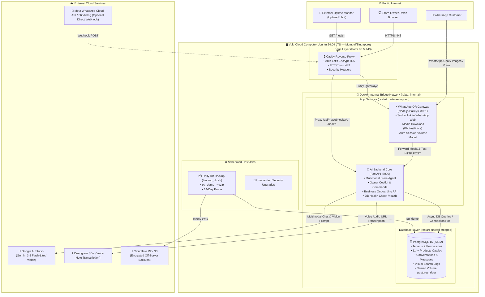
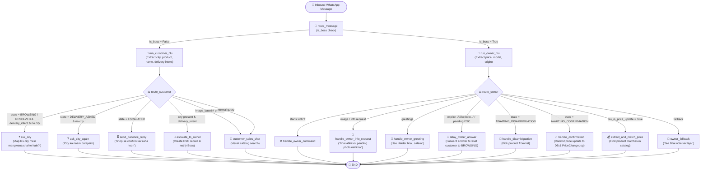

# Rabta AI — Production System Architecture

---

## Component Responsibilities

| Service | Technology | Port (Internal) | External Access | Key Responsibility |
|---|---|---|---|---|
| **Caddy** | Caddy v2 Alpine | `80`, `443` | `80`, `443` (Public) | Handles HTTPS certificates via Let's Encrypt, security headers, and routes inbound traffic. |
| **Backend** | Python 3.11 / FastAPI | `8000` | Via Caddy only | Runs Gemini multimodal AI agent, tenant-isolated DB queries, owner copilot commands, and business onboarding. |
| **Gateway** | Node.js 20 / Baileys | `3001` | Via Caddy (`/gateway/*`) | Bridges WhatsApp Web protocol, auto-downloads media (images/voice) into Base64 for the AI engine. |
| **PostgreSQL** | PostgreSQL 16 Alpine | `5432` | Internal Docker network only | Relational and catalog store for tenants, products, customers, and conversation histories. Zero port exposure on the public internet. |

---

## Conversational State Graph Architecture (LangGraph)

> **Mandatory Rule for All Future Conversational Features:**
> Every conversational flow (sales chat, delivery escalation, price updates, discounts, order booking) MUST be modeled as nodes and edges within the single root graph in `backend/app/graph/builder.py`.

### Core Architectural Separation:
1. **The LLM (Gemini) NEVER decides what happens next.** It is restricted solely to:
   - **NLU Understanding (`graph/nodes/nlu.py`)**: Extracting entities (product, city, name, price, origin) and classifying intents.
   - **Natural Reply Generation (`graph/nodes/customer.py`)**: Generating grounded Urdu/English text based on verified catalog context.
2. **Deterministic Code Controls All State Transitions:**
   - Edges in `graph/builder.py` route conversation state based on pure typed functions.
   - States (`BROWSING`, `DELIVERY_ASKED`, `ESCALATED`, `RESOLVED`, `AWAITING_DISAMBIGUATION`, `AWAITING_CONFIRMATION`) are explicit and typed in `RabtaGraphState`.
3. **Persistent Checkpointing (`graph/checkpointer.py`):**
   - Thread ID convention: `"{tenant_id}:{sender_phone}"` (e.g. `0a28e3db-49c5...:923005510670`).
   - Checkpoints persist across backend container restarts and deploys using PostgreSQL `AsyncPostgresSaver`.
   - Resolving an escalation via `relay_owner_answer` explicitly updates the customer's persisted checkpoint via `graph.aupdate_state()` so the customer naturally returns to `BROWSING`.

